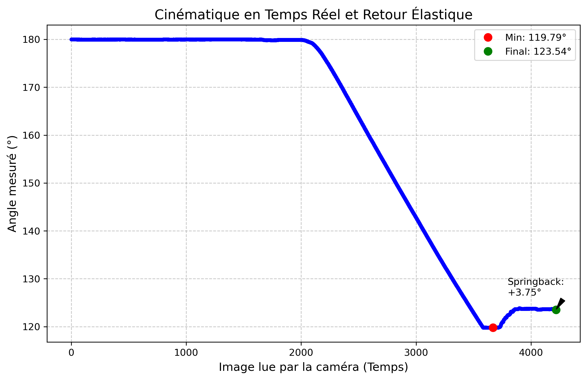

# PROJ901 - Suivi du pliage en l'air par corrélation d'images (DIC)

Ce projet a pour objectif de développer une méthode de mesure automatique du pliage en l'air à partir d'images acquises pendant l'essai. L'objectif est de suivre l'évolution de la géométrie d'une tôle pendant le procédé et d'identifier le retour élastique (springback).

Le programme développé permet d'analyser une séquence d'images d'un essai de pliage et de mesurer automatiquement : 
- l'évolution de l'angle de pliage,
- l'angle minimal atteint sous charge,
- l'angle final après retrait du poinçon,
- la valeur du retour élastique.

## Contexte

Le pliage de tôles est un procédé fondamental utilisé dans de nombreux domaines : automobile, aéronautique, tôlerie industrielle, fabrication d'équipements métalliques. Parmi eux, le pliage en l'air est l'une des méthodes les plus utilisées en raison de sa grande flexibilité de production, de la possibilité d'obtenir différents angles avec un même outillage et de sa rapidité de mise en oeuvre.

Pour réaliser ce procédé, une tôle est d'abord positionnée sur une matrice en V. Puis, un poinçon vient appliquer un effort vertical afin de provoquer la déformation plastique du matériau. L'angle final obtenu dépend principalement :
- de la course du poinçon,
- de l'ouverture de la matrice en V,
- de l'épaisseur de la tôle,
- des propriétés mécaniques du matériau.

## Problématique

Cependant, un phénomène important apparaît lors du pliage de la tôle : le retour élastique (appelé springback).

En effet, pendant le pliage, la tôle subit une déformation plastique permanente, mais aussi une déformation élastique temporaire.

Lorsque le poinçon est retiré, la partie élastique de la déformation se relâche et la tôle s'ouvre légèrement. Cela entraîne une variation entre l'angle mesuré sous charge (pendant l'action du poinçon) et l'angle final obtenu après relâchement.

Ce phénomène peut provoquer des erreurs géométriques sur la pièce final et nécessite généralement des ajustements dans le procédé : il devient donc important de pouvoir mesurer précisément ce retour élastique.

## Objectif du projet

L'objectif du projet est de développer une méthode permettant de mesurer automatiquement l'évolution du pliage à partir d'images.

Plus précisément, il s'agit de concevoir un dispositif de mesure in-line basé sur la vision par ordinateur permettant de :
- suivre l'évolution de l'angle de pliage en temps réel,
- identifier l'angle minimal atteint sous charge,
- mesurer l'angle final après déchargement,
- calculer automatiquement la valeur du springback.

L'objectif à plus long terme serait de pouvoir intégrer ce type de mesure directement dans la machine de pliage afin de réaliser un contrôle en ligne du procédé.

## Solution retenue

Pour mesurer l'angle de pliage, nous avons choisi d'utiliser une méthode basée sur la Corrélation d'Images Numériques (Digital Image Correlation, DIC). La DIC est une méthode de vision par ordinateur utilisée en mécanique qui permet de mesurer les déplacements d'un objet en comparant les images prises à différents instants.

Elle repose sur le suivi d'un motif aléatoire (appelé speckle) applique sur la surface de la pièce.

Le principe est le suivant :
1. On applique un motif aléatoire (speckle) sur la surface de la tôle.
2. Des images de la pièce sont acquises pendant le pliage.
3. L'image est découpée en petites zones contenant des motifs uniques.
4. Ces motifs sont suivis d'une image à l'autre afin de mesurer leurs déplacements.
5. Les déplacements permettent ensuite de calculer les rotations et déformations de la pièce.

Dans notre cas, l'analyse se concentre sur les deux ailes de la tôle, ce qui permet de mesurer directement l'évolution de l'angle de pliage.

## Principe de la méthode

Le prince de mesure mis en place dans ce projet est le suivant :
1. Acquisition d'une séquences d'images du pliage.
2. Sélection de deux zones d'analyse sur les ailes de la tôle.
3. Détection automatique de points de texture dans ces zones.
4. Suivi du déplacement de ces points au cours du temps.
5. Calcul de l'orientation des deux ailes de la tôle.
6. Calcul de l'angle de pliage pour chaque image.
7. Identification de l'angle minimal sous charge et l'angle final après relâchement du poinçon.
8. Calcul du retour élastique.

Pendant l'analyse des images, le programme place deux segments sur chaque aile de la tôle afin de mesurer l'angle de pliage à un instant t, par exemple :

## Architecture du projet

Le projet se décompose en deux parties principales.

### 1. Acquisition des images

Les images du pliage sont acquises pendant l'essai grâce à un système de prise de vue positionné face à la tôle.

Ces images servent de données d'entrée pour l'analyse.

### 2. Traitement des images

Un programme Python a été développé pour analyser automatiquement les images.

Le programme réalise : 
- le suivi des speckles,
- le calcul de l'angle de pliage,
- l'identification du retour élastique.

Le fonctionnement détaillé du code est expliqué dans le `README_technique` du projet.

## Résultat attendu

A partir des images du pliage, le programme permet d'obtenir automatiquement :
- l'évolution de l'angle de pliage au cours du temps,
- l'angle minimal atteint sous charge,
- l'angle final après deéchargement,
- la valeur du retour élastique (springback).

Les résultats sont présentés sous forme d'une vidéo du suivi du pliage, et d'un graphique montrant l'évolution de l'angle, par exemple :

Ici, le graphe obtenu correspond à un essai réalisé sur un test en temps réel du pliage d'une tôle à 120°.
